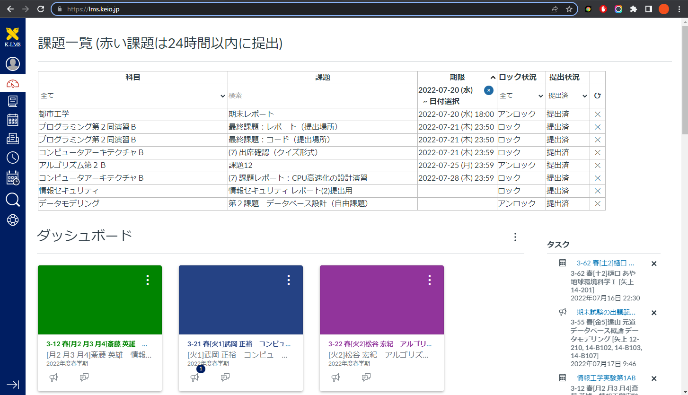
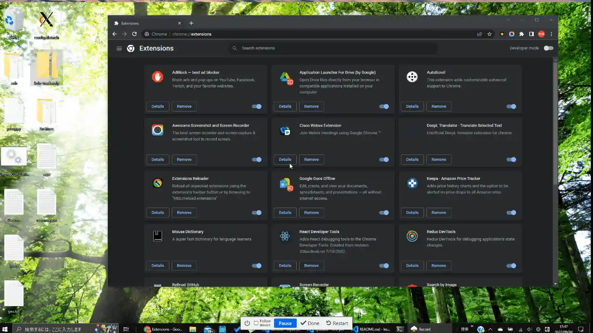

# Keio Tracker

This extension allows you to view all available assignments on K-LMS, a learning management system for Keio University.

- You can filter assignments by course name, assignment name, deadline, lock status and submission status.

- You can click the assignments to jump to corresponding page.

- You can hide assignments by clicking ✕ button and reset by ⟳ button.
  This operation is persistent.

### Installation

1. Download [keio-tracker.zip](https://github.com/tong-poo/keio-tracker/releases/download/v0.1/keio-tracker.zip).

2. Open chrome://extensions for Chrome or edge://extensions for Edge.

3. Enable Developer Mode and **reload**.

4. Drag and drop the zip file onto the page.

